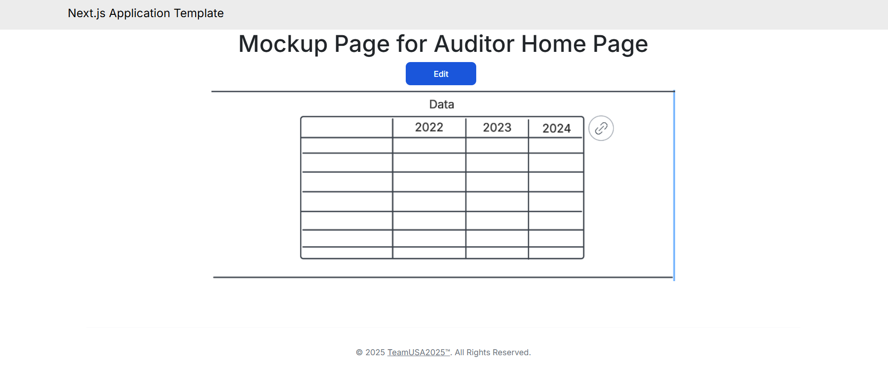
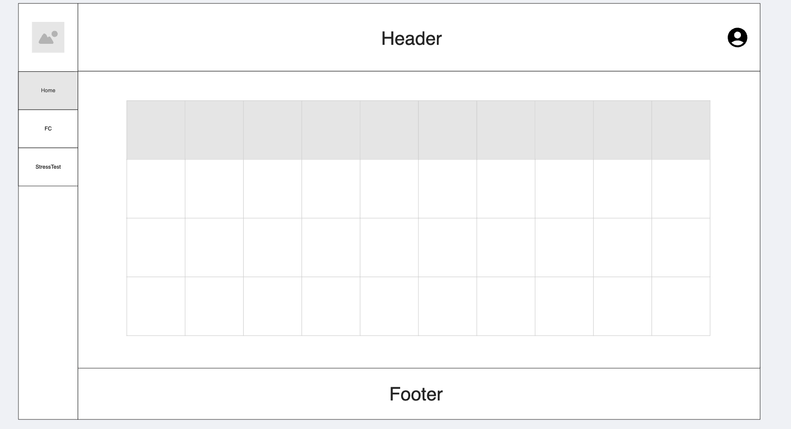
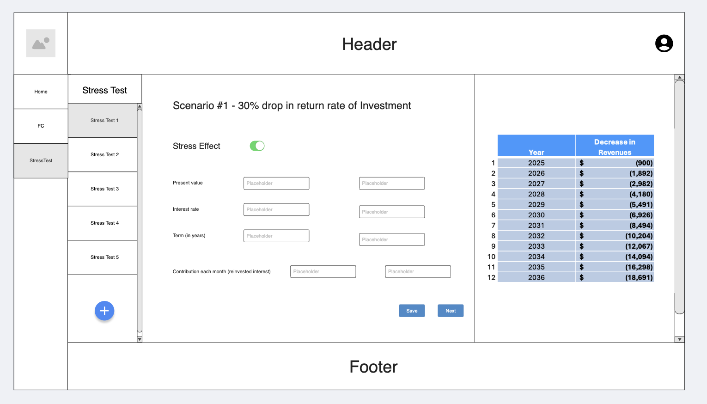
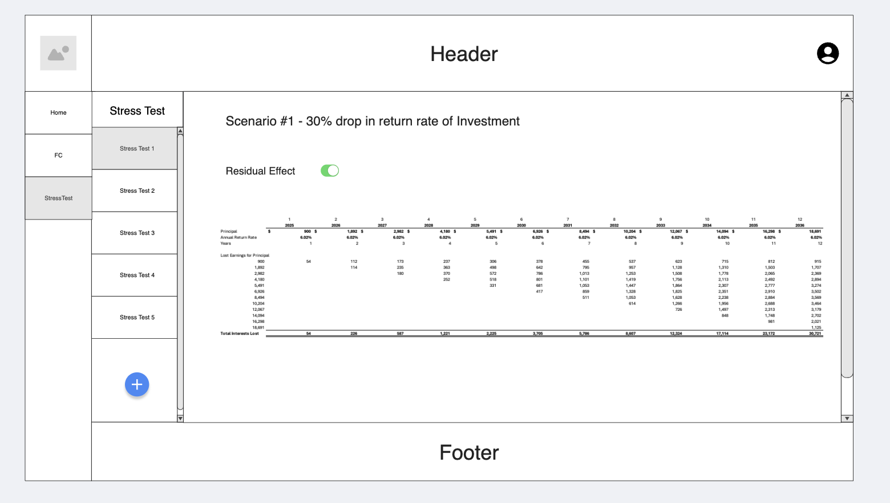
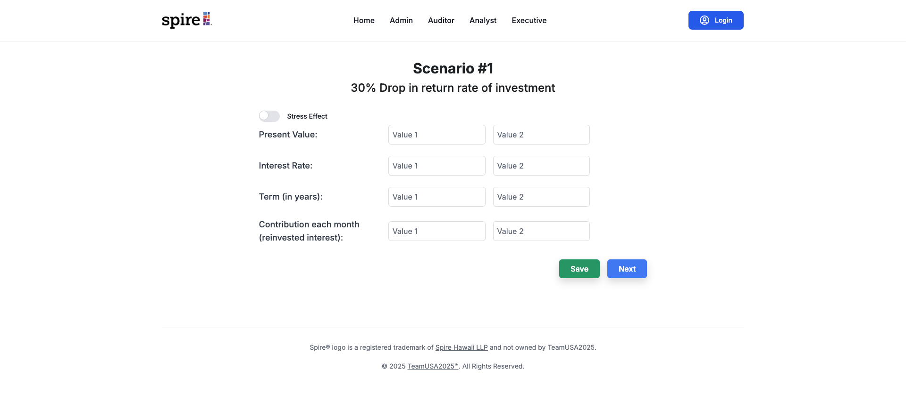
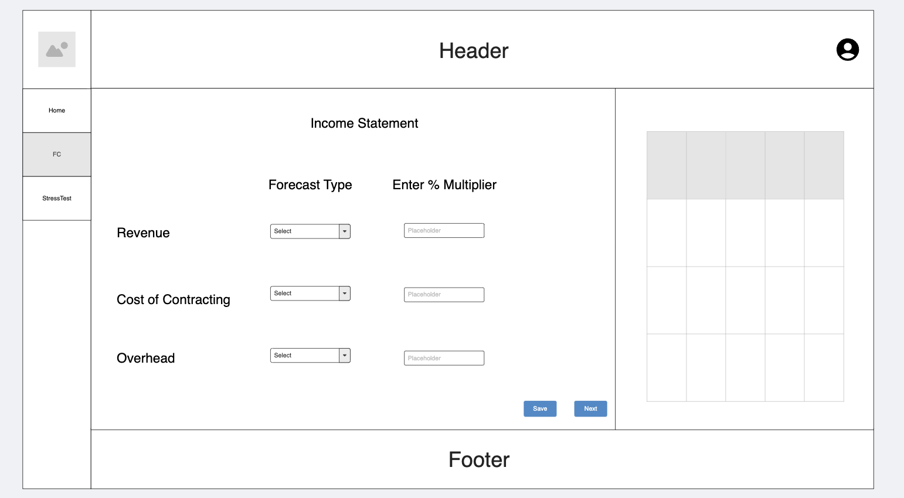
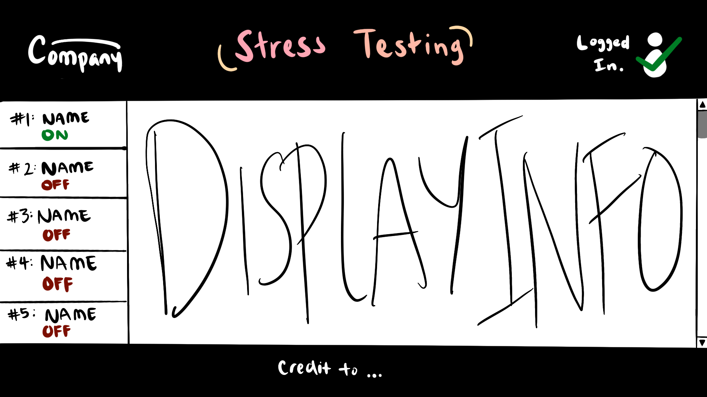
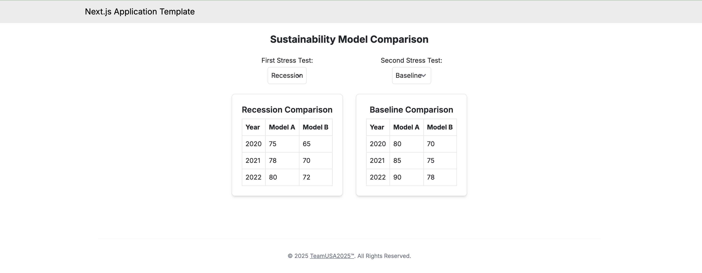
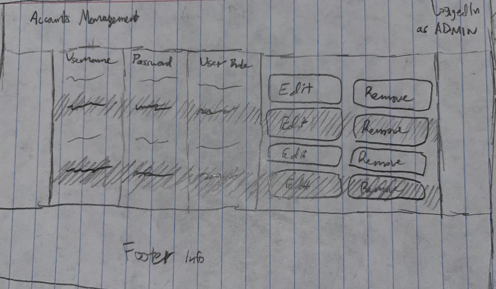

# TeamUSA2025

## Table of contents

* [Overview](#overview)
* [Deployment](#deployment)
* [User Guide](#user-guide)
* [Community Feedback](#community-feedback)
* [Developer Guide](#developer-guide)
* [Development History](#development-history)
* [Continuous Integration](#continuous-integration)
* [Walkthrough videos](#walkthrough-videos)
* [Example enhancements](#example-enhancements)
* [Team](#team)
* [Team Contract](#team-contract)

## Overview

TeamUSA2025 is a web application that integrates excel spreadsheet worksheets to create a user-friendly financial stress testing tool. It is designed for implementing the Fiscal Sustainability Model in a more streamlined and less daunting process than the traditional methods.

The database will be created with the use of [NextJS](https://nextjs.org/) and [PostgreSQL](https://www.postgresql.org/). **The rest of this page will be updated as the project moves along.**

## User Guide
This web application involves a number of distinct user roles, specifically: auditor, analyst, executive, and admin. Auditors may add audited data to the database. Analysts make changes to stress tests, which are able to be applied to financial projections. Executives are able to review their sustainability model's projections and apply the analysts' stress tests to see how possible stressors affect final outcomes. Admins are able to see all users, their passwords, and their role(s) and is able to edit and remove them as needed.

### Auditor Home Page

The Auditor home page contains a table of audited information currently in the database organized by year, as well as the ability to add, change, and correct audited information in the database.

### Analyst Home Page

### Analyst Stress Test Editor & Effects

The Analyst pages allow an analyst to alter any of 5 stress tests to be toggled on/off in for financial future calculations. Analysts also have access to the residual effects of each test as applied to future projections, and can see the same dashboard of presentable information that the Executive role can. 

### Analyst Financial Compilation Page

This page allows Analysts to select from and set values for the type of forecast used to calculate financial future projections.

### Executive Stress Test Impact Page

Executives use this page to understand the company's finances, seeing in real-time the effects different stressors may have on their long-term sustainability.

### Executive Model Comparison Page

Here, Executives can do a side-by-side comparison of different high-level scenarios, like comparing a recession to business-as-usual.

### Admin Accounts Manager Page

Admins use this page to add, remove, and change the usernames, passwords, and user roles of the various people who have an account.

## Community Feedback

## Developer Guide

### Installation

### Application Design

### Data model

## Initialization

### Quality Assurance

#### ESLint

#### End to End Testing

## From mockup to production

## Continuous Integration

## Development History

### Milestone 1: Mockup development

The goal of Milestone 1 is to create a set of mockup pages for this project.

Milestone 1 is managed using [TeamUSA2025 GitHub Project Board M1](https://github.com/orgs/teamusa2025/projects/1).

At this time, our team collected [user stories](https://github.com/teamusa2025/teamusa2025-project/discussions/7) to facilitate our project's goals.

### Milestone 2: Data model development

### Milestone 3: Final touches

## Walkthrough videos

## Example enhancements

## Team

TeamUSA2025 is designed, implemented, and maintained by [Ciara Kang](https://github.com/kngcr), [Jalem Lum](https://github.com/jalenlum), [Cyril Rigor Aris](https://github.com/cyrilra), [Gian Panoy](https://github.com/gianpanoy), [Donald Lipps](https://github.com/lippsd), [Javin Solmirin](https://github.com/JavinSol), [Yu Fang Ma](https://github.com/yu-fang-ma), and [Seth Ines](https://github.com/sethines).

## Team Contract

Our team contract can be viewed [here](https://docs.google.com/document/d/1KknM4q7407r0Rnnhx9ZoOViNYUF3UhPKtRtRfh242Ok/edit?usp=sharing).
